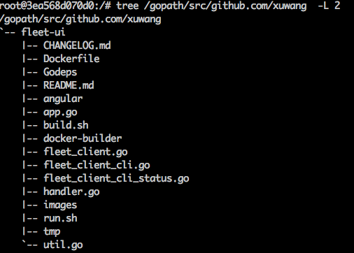

# Build fleet-ui docker image

## Quick start

Before build, change the following line in Dockerfile to your forked fleet-ui repo. I forked my repo from [fleet-ui](https://github.com/purpleworks/fleet-ui.git) and updated fleetctl to 0.9.1., among other things.

	ENV FLEETUIREPO github.com/xuwang/fleet-ui

Then run:

	./build.sh

It builds two images. The first one is _fleet-ui-builder_, and then the script calls it to build _fleet-ui_.

## How does it work

The builder Dockerfile creates an isolated docker enviromment, with the software packages and docker daemon installed. The result 
image is called _fleet-ui-builder_ which, when run, will build _fleet-ui_ docker image. _fleet-ui_ image is the one you will run or push to your dockerhub account to share. 

The builder environment includes:

* golang 1.4
* npm, ruby, gem etc.
* docker from Debian/Wheezy release
* fleetctl 0.9.1 
* fleet-ui binary compiled from repo defined at the top of the Dockerfile

The builder image can be removed when you are sure you have a good fleet-ui image: 

        docker rmi fleet-ui-builder:latest

## Run the fleet-ui on CoreOS

Here is an example of how to [run fleet-ui on CoreOS](https://github.com/xuwang/coreos-docker-dev/blob/master/README-fleet-ui.md)

## Troubleshoot

If you have problem with the fleet-ui, you can debug your builder environment by run the builder image:

        docker run --rm -i -t fleet-ui-builder bash

The src code is located at /gopath diretory:

Then you can manually run steps in the builder Dockerfile to troubleshoot issues.
